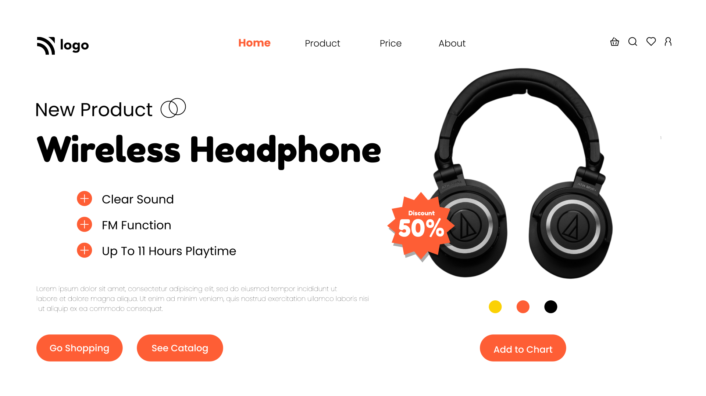

# Project-7 Landing Page  

## [Live Preview](https://project-7-pied.vercel.app/) :link:

## Project Goal :dart:

The Objective of this project was to style the webpage as shown in the mockup provided. Without modifying the html provided.

## Skills Gained

- learned to use `filter:drop-shadow()` css property.
- Using Pseudo elements to replace list-markers.

## Time Taken For Completion

```
 2 Hours
```

## Intended Outcome:



> This project is part of full stack Javascript web-dev bootcamp hosted by [iNeuron.](https://ineuron.ai/)
